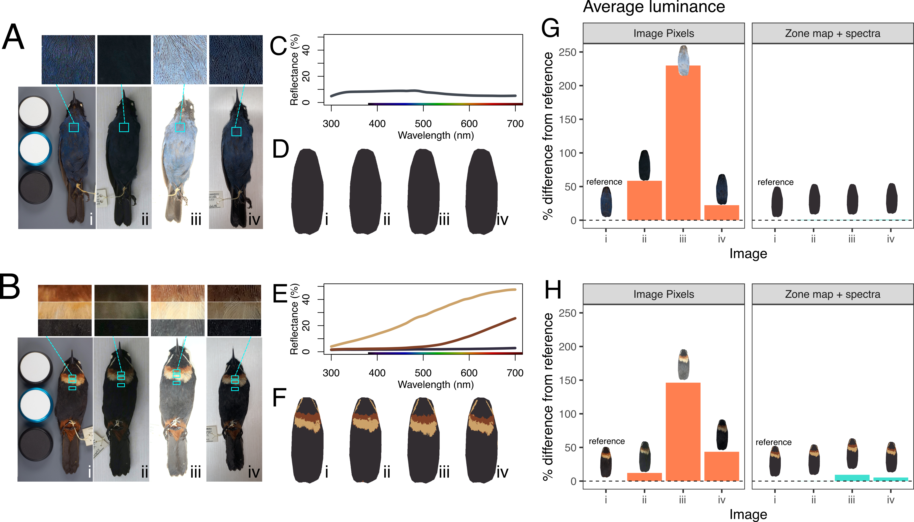

# Recolorize examples

A repository with example files and code illustrating how to use the `recolorize` package (https://github.com/hiweller/recolorize). Before running these examples, I recommend installing the development version of the package:

```{r}
install.packages("devtools")
devtools::install_github("hiweller/recolorize")
```

Alternatively, you can install the release version of the package from CRAN (just know that this will lag behind the development version):

```{r}
install.packages("recolorize")
```


# Examples included

* 01_neolamprologus:


> Wild *Neolamprologus* cichlid images are all courtesy [Ad Konings](https://www.cichlidpress.com/).

* 02_wasps:

> *Polistes fuscatus* social wasp images are courtesy James Tumulty, excerpted with permission from [this paper](https://www.biorxiv.org/content/10.1101/2021.09.07.459327v1.abstract).

* 03_birds:

> All flowerpiercer (*Diglossa* spp.) birds were photographed by Anna E. Hiller.

* Two examples running single images.


## Running these examples

1. Clone the GitHub repository, either by clicking the green 'Code' button and downloading/unzipping the zip file, or by cloning the repository:

```
git clone https://github.com/hiweller/recolorize_examples.git
```

2. If you are using RStudio, open on the `recolorize_examples.Rproj` file in this directory to open R in the home directory of this repository. Otherwise, open R and use `setwd()` to set the working directory to this directory (`setwd([path/to/folder]/recolorize_examples)`).
3. Execute all scripts in each folder from this directory, not the subdirectories.
4. For examples 1-3, it is recommended to execute the scripts in their alphabetic order, e.g. `01_a_alignment.R`, then `01_b1_recolorize.R`, `01_b2_kmeans_fits.R`, then `01_c_PCA.R` to understand how the examples go from input images to final output. However, for each example, the intermediate files generated by each step are saved as RDS files in an `rds_files` folder, so you can also run them out of order and they should still work.

